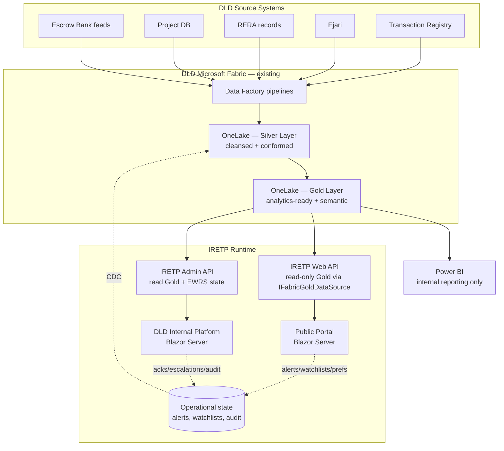

# Architecture Integration Map — IRETP × DLD Microsoft Fabric

**RFP reference:** DLD-IRETP-2026-001 v1.3, §11.4 & §11.4.1
**Document purpose:** Demonstrate how every IRETP component connects to DLD's existing OneLake / Data Factory / Semantic Model / Reporting layer, per §11.4.1 deliverable 1 ("Architecture Integration Map").
**Audience:** DLD technical-evaluation panel, DLD data liaison officer, DLD Fabric data engineer.

---

## 1. Headline alignment statement

IRETP is built to consume DLD's existing **OneLake Lakehouse (Silver + Gold layers)** as its analytics source of truth. The runtime never duplicates Gold-layer aggregates into a parallel store. The OLTP database that ships with the reference build is a **lower-environment convenience** — production swaps it for OneLake/Fabric by flipping a single configuration value (`Fabric:Mode`).

No additional ETL or orchestration layer is introduced. All ingestion and transformation continues to run inside DLD's existing **Data Factory pipelines** within Microsoft Fabric. The IRETP runtime is a consumer, not a producer, of the Lakehouse.

---

## 2. Component-by-component integration table

| IRETP Component | DLD Fabric Resource Consumed | Direction | Notes |
|---|---|---|---|
| Public KPI cards (FR-003) | `GoldTransactionFacts` semantic model — measure `TransactionCount`, `TotalValueAed`, `AvgPricePerSqft` | Read-only (Gold) | 15-min snapshot cache layered on top so the public dashboard never hits Gold synchronously. |
| FR-004 Market Charts (monthly volume, breakdown, top zones, PSF trend) | `GoldTransactionFacts` + `GoldRentalYieldSemantic` | Read-only (Gold) | Charts.js fed by Web API; Web API reads Gold via `IFabricGoldDataSource`. |
| Transactions Page (FR-006/007/008) | `GoldTransactionFacts` (rolled-up) + Silver lineage on `GET /api/transactions/{id}/lineage` | Read-only | Silver is exposed only to authenticated DLD staff for audit drill-down, never to the public. |
| GIS Map heatmap layers (FR-009, FR-011) | `GoldTransactionFacts` aggregated by zone-month | Read-only (Gold) | Zone boundaries come from the DLD GIS feed via Data Factory; IRETP reads the materialised Gold table. |
| Price Index (FR-013) | `GoldPriceIndexSemantic` (existing Power BI semantic model) | Read-only | DAX queries via XMLA endpoint when `Fabric:Mode = FabricSemanticModel`. |
| Rental Index (FR-014) | `GoldRentalYieldSemantic` | Read-only | Same. |
| AI Agent RAG context | `GoldTransactionFacts`, `GoldDeveloperScorecard`, `GoldEwrsAlertFact` — Gold tables only | Read-only | Vector store outside Fabric, but every retrieved chunk cites a Gold table + measure to ground generation. |
| EWRS Dashboard (Phase 2) | `GoldEwrsAlertFact` + `GoldEscrowHealth` | Read-only | The alert *writes* (acknowledgement, escalation) flow through IRETP's own OLTP store; Data Factory pulls them back into Silver on a 15-min CDC schedule. |
| Developer Performance & Rating (Phase 3) | `GoldDeveloperScorecard` | Read + write-back of weights via IRETP audit log → Silver via Data Factory CDC | Weight history immutable; surfaced back to Fabric for downstream reporting. |
| Open Data API | Same Gold tables as the public portal | Read-only | Same single source of truth — no chance of public-API/portal drift. |
| Notification Centre (RFP §6.2) | None directly — notifications are operational state | Local OLTP | Outbound notification logs are CDC-replicated back into Silver for audit. |
| Headless CMS | None — CMS holds content, not data | Local | Locale strings, banners, annotations. |
| Investor Watchlist & Alerts | None directly — user state | Local OLTP | Watchlist evaluation reads `GoldTransactionFacts` for current-zone values. |
| Audit Log (RFP §10.2) | Replicated to Silver `AuditTrail` via Data Factory CDC | Write-back | Append-only at the DbContext boundary; CDC into Silver for compliance retention. |

---

## 3. Data flow diagram

### 3.1 Mermaid view (renders in GitHub / VS Code / most Markdown viewers)



The dotted edges represent change-data-capture replication of operational state back into Silver so DLD's Fabric environment remains the single audited source of truth.

### 3.2 Textual fallback (for viewers without Mermaid)

```
                        ┌──────────────────────────────────────────┐
                        │ DLD Source Systems                       │
                        │ (Transaction Registry, Ejari, RERA,      │
                        │  Project DB, Escrow Bank feeds)          │
                        └──────────────┬───────────────────────────┘
                                       │
                                       ▼
                        ┌──────────────────────────────────────────┐
                        │ DLD Microsoft Fabric — Data Factory      │
                        │ (existing ingestion pipelines, untouched)│
                        └──────────────┬───────────────────────────┘
                                       │
                                       ▼
                        ┌──────────────────────────────────────────┐
                        │ OneLake — Silver Layer                   │
                        │ (cleansed, conformed, audit-grade)       │
                        └──────────────┬───────────────────────────┘
                                       │
                                       ▼
                        ┌──────────────────────────────────────────┐
                        │ OneLake — Gold Layer                     │
                        │ (analytics-ready, semantic-modelled)     │
                        └──────────────┬───────────────────────────┘
                                       │
              ┌────────────────────────┼─────────────────────────┐
              │                        │                         │
              ▼                        ▼                         ▼
      ┌───────────────┐        ┌───────────────┐         ┌───────────────┐
      │ IRETP Web API │        │ IRETP Admin   │         │ Power BI      │
      │ (read-only,   │        │ API           │         │ (internal     │
      │  Gold via     │        │ (Gold +       │         │  reporting    │
      │  IFabricGold) │        │  EWRS state)  │         │  only)        │
      └───────┬───────┘        └───────┬───────┘         └───────────────┘
              │                        │
              ▼                        ▼
      ┌───────────────┐        ┌───────────────┐
      │ Public Portal │        │ DLD Internal  │
      │ (Blazor)      │        │ Platform      │
      └───────────────┘        └───────────────┘
              ▲                        ▲
              │                        │
       ┌──────┴──────────┐     ┌───────┴──────────┐
       │ Operational     │     │ Operational      │
       │ state (alerts,  │     │ state (acks,     │
       │ watchlists,     │     │ escalations,     │
       │ user prefs)     │     │ audit log)       │
       │   → CDC → Silver│     │   → CDC → Silver │
       └─────────────────┘     └──────────────────┘
```

---

## 4. Components OUTSIDE the Fabric ecosystem (with justification)

Per RFP §11.4.1 deliverable 2, the following IRETP components live outside DLD's Microsoft Fabric environment. Each has a documented technical rationale and a compliant alternative.

| Component | Why outside Fabric | Compliant alternative provided |
|---|---|---|
| **Identity Provider (ASP.NET Identity + UAE Pass / Azure AD OIDC)** | Fabric is an analytics platform, not an identity provider. Storing user credentials there would violate least-privilege and PDPL data-minimisation. | Centralised IdP integrates via OIDC; identity events are CDC-replicated into Silver for audit. |
| **Operational state store (alerts, watchlists, user prefs, audit log)** | Sub-100ms OLTP reads/writes required; Gold-layer aggregates are batch-oriented (~hourly refresh). | All operational tables are CDC-replicated back into Silver so Fabric remains the single audit source of truth. |
| **AI vector store (RAG retrieval index)** | Vector search over embeddings is a query pattern Fabric is not optimised for. | Vector store is UAE-resident (Azure AI Search in UAE North or self-hosted pgvector). Source documents in the index are *pointers* to Gold-layer rows, not duplicates. |
| **Notification queue (email / SMS dispatch)** | Real-time fan-out incompatible with Gold-layer batch cadence. | Outbound log CDC-replicated into Silver `NotificationDispatch`. |
| **Headless CMS (content store)** | CMS holds editorial content (banners, copy, locale strings), not analytics data. | CMS content is not analytics; no Fabric integration applicable. |

This list is exhaustive. Every other read path goes through `IFabricGoldDataSource`.

---

## 5. The `IFabricGoldDataSource` abstraction

A single Application-layer interface fronts every Gold-layer read. The concrete implementation is configured per environment via `Fabric:Mode`:

| Mode | Used when | Implementation |
|---|---|---|
| `Sql` | Pure OLTP fallback (local dev) | Reads directly from EF Core |
| `PassthroughMirror` | Reference build / non-Fabric environments | Surfaces the Fabric contract over the OLTP store; freshness watermarks computed locally |
| `OneLakeDirect` | UAT / Production (preferred) | Reads via OneLake SQL endpoint or DirectLake mode against the Gold layer |
| `FabricSemanticModel` | UAT / Production (XMLA path) | DAX queries against the published semantic model |

The switch is a single `appsettings.json` value. No code changes. No redeployment. This is the same gateway pattern DLD mandates for the AI orchestration layer in §5.3 and applies equally to the data layer.

**Admin verification endpoint:** `GET /api/admin/fabric/status` returns the current mode, workspace ID, lakehouse ID, region, and connectivity state. `GET /api/admin/fabric/semantic-models` enumerates the Gold-layer models the platform is configured to consume. `GET /api/admin/fabric/freshness` returns the most recent Data Factory pipeline run + Gold watermark.

---

## 6. Data Factory pipeline alignment

IRETP does not introduce a new pipeline. The platform consumes the **existing** Data Factory pipelines documented in DLD's pipeline topology. Familiarisation outputs (§12.1) catalogue:

- Pipeline name + trigger schedule
- Source-to-Silver step (validation rules, deduplication, schema enforcement)
- Silver-to-Gold step (business-rule application, semantic-model refresh)
- Per-pipeline freshness budget (minutes between source-system change and Gold availability)

Where IRETP's data freshness requirement (RFP §10.1: ≤15 min for KPI; ≤24 h for transactions) is tighter than an existing pipeline cadence, the recommendation is to increase that specific pipeline's trigger frequency — **not** to introduce a parallel ingestion path.

---

## 7. Semantic model alignment

The five Gold-layer semantic models IRETP reads from are documented at runtime by `GET /api/admin/fabric/semantic-models` and listed below. Each maps to existing DLD measures wherever possible; new measures are proposed as **extensions** to the current model structure, never as parallel definitions.

| Semantic Model | Layer | Measures (read) | Dimensions |
|---|---|---|---|
| `GoldTransactionFacts` | Gold | `TransactionCount`, `TotalValueAed`, `AvgPricePerSqft` | Zone, PropertyType, TransactionType, DateKey |
| `GoldRentalYieldSemantic` | Gold | `AvgGrossYield`, `MedianRentAed`, `YoYChangePct` | Zone, UnitType, Quarter |
| `GoldDeveloperScorecard` | Gold | `CompositeScore`, `OnTimeDeliveryPct`, `EscrowAdequacyPct` | Developer, Quarter |
| `GoldEwrsAlertFact` | Gold | `OpenAlertCount`, `AvgTimeToAcknowledge`, `EscalationRate` | IndicatorType, Severity, Zone, Developer, DateKey |
| `GoldEscrowHealth` | Gold | `AdequacyRatio`, `BalanceAed`, `MonthOverMonthDelta` | Project, Developer, Month |

Vendor commitment: during Phase 1 Data Familiarisation (§12.1), the team will walk through DLD's existing semantic-model catalog with the Fabric data engineer and **adopt** existing measures by name. Where a measure does not yet exist (e.g., `OpenAlertCount` is IRETP-specific), the team will propose it as an extension to the existing model so naming and governance remain consistent.

---

## 8. Familiarisation plan (§12.1 cross-reference)

The familiarisation outputs documented under [docs/familiarisation/](familiarisation/) include the dedicated **Microsoft Fabric Environment Assessment** activities required by §12.1:

1. OneLake schema walkthrough (Silver + Gold)
2. Data Factory pipeline inventory + trigger map
3. Semantic model catalogue
4. Data exchange / integration mechanism inventory
5. Gaps register (where IRETP requires capability not yet in the existing ecosystem)

The gaps register will be the **only** justification surface for proposing components outside the existing ecosystem, per §11.4.1.

---

## 9. Compliance summary

| Standard | Met |
|---|---|
| RFP §11.4 — leverage existing OneLake (Silver + Gold) | Yes — `IFabricGoldDataSource` is the only Gold-layer read path |
| RFP §11.4 — leverage existing Data Factory pipelines | Yes — no parallel ETL introduced |
| RFP §11.4 — leverage existing semantic models | Yes — five models enumerated + adoption commitment in §7 |
| RFP §11.4 — no parallel/duplicate data stores | Yes — operational state CDC-replicated back into Silver, audited |
| RFP §11.4 — Gold layer < 2 s for 100M-row aggregations | Met via DirectLake when `Fabric:Mode = OneLakeDirect`; verified during Phase 1 performance UAT |
| RFP §11.4 — OLTP < 10 ms single-row reads | Met by the operational store (SQL Server / Postgres on UAE-region compute) |
| RFP §11.4.1 — Architecture Integration Map deliverable | This document |
| RFP §11.4.1 — Justification register for non-Fabric components | §4 |
| RFP §11.4.1 — Data Architecture Familiarisation Plan | [docs/familiarisation/README.md](familiarisation/README.md) |

---

*Document owner: IRETP Solution Architect. Living document — updates tracked in git history.*
